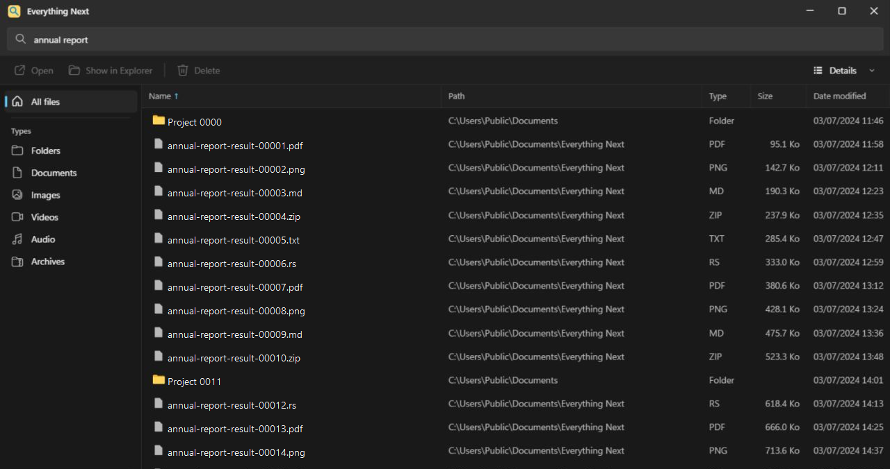
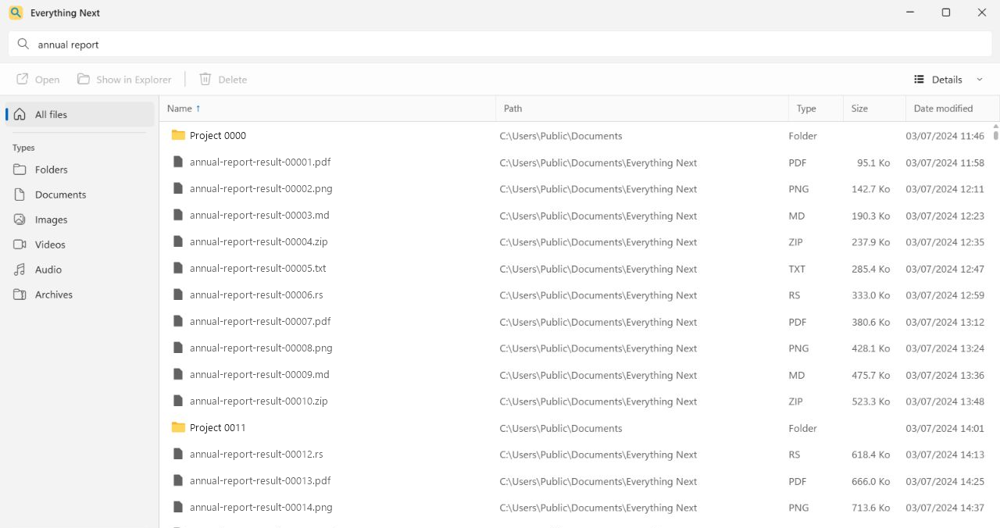

<p align="center">
  
</p>

<h1 align="center">Everything Next</h1>

<p align="center">
  <a href="https://stephanorgiazzi.github.io/EverythingNext/">
    
  </a>
</p>

<p align="center">
  <strong>Find any file on Windows before you finish typing.</strong>
</p>

<p align="center">
  Everything's instant search, delivered through a lightweight Windows 11 app engineered in Rust for speed and low overhead.<br>
  Built with Tauri and Leptos. Everything 1.5 and SDK3 are included.
</p>

<p align="center">
  <a href="./LICENSE"></a>
  <a href="https://www.rust-lang.org/"></a>
  <a href="https://tauri.app/"></a>
  <a href="https://leptos.dev/"></a>
  
  
</p>

<p align="center">
  <a href="https://github.com/StephanOrgiazzi/EverythingNext/releases"><strong>Download for Windows</strong></a>
  ·
  <a href="#why-everything-next">Features</a>
  ·
  <a href="#build-from-source">Build from source</a>
  ·
  <a href="https://github.com/StephanOrgiazzi/EverythingNext/issues">Report a bug</a>
</p>

<p align="center"><strong>Native dark and light themes</strong></p>

<p align="center">
  
  
</p>

<p align="center">
  <a href="https://stephanorgiazzi.github.io/EverythingNext/"><strong>Everything Next Website</strong></a>
  <br />
  <sub>stephanorgiazzi.github.io/EverythingNext</sub>
</p>

Everything Next is an open-source desktop client for [Everything](https://www.voidtools.com/) 1.5. It keeps Everything's native query syntax and fast index, then adds the file actions, keyboard controls, views, and Windows 11 native-like design.

## Why Everything Next

| | |
|---|---|
| **Search at typing speed** | Queries start 55 ms after the last keystroke and use Everything's native search syntax. |
| **One installer** | Everything 1.5.0.1418b x64 and SDK3 3.0.0.9 ship with the app. No separate Everything installation is required. |
| **Built for large result sets** | Viewport pagination, a sliding cache, and a virtualized list keep result handling bounded. |
| **File actions where you need them** | Open, show in Explorer, copy, rename, or move one or thousands of selected files to the Recycle Bin. |
| **A Windows-first interface** | Details and icon views, progressive Windows Shell visuals, light and dark themes, and restored window state. |
| **Keyboard-first control** | Navigate, sort, extend selections, open files, rename, and delete without leaving the keyboard. |

You can sort by name, path, type, size, or modified date; filter by common file types; exclude folders; and switch between details, small icons, medium icons, and large icons.

## Download

1. Open the [Releases](https://github.com/StephanOrgiazzi/EverythingNext/releases) page.
2. Download the NSIS `.exe` installer for the version you want.
3. Run the installer, then launch `EverythingNext.exe`.

> [!NOTE]
> Everything Next currently targets Windows 11 x64. The installer runs per machine, installs to `Program Files`, and requests administrator approval to configure its indexing service.

The bundled engine:

- runs without a separate Everything installation;
- stays hidden, with no engine window or notification icon;
- stores its configuration and database in `%LOCALAPPDATA%\EverythingNext\Engine`;
- uses the private `Everything Service (EverythingNext)` service;
- exposes the default Everything IPC instance for compatibility with SDK2 clients.

The default Everything IPC instance is exclusive. If classic Everything already owns it, Everything Next asks you to close that process instead of connecting to its database.

## PowerToys Run

Everything Next works with the [EverythingPowerToys](https://github.com/lin-ycv/EverythingPowerToys) plugin.

In **PowerToys Settings → PowerToys Run → Everything**, set **Everything path** to the installed `EverythingNext.exe`.

The plugin can then:

- read results through the default Everything IPC instance;
- open **Show more results** with `EverythingNext.exe -s "query"`.

If Everything Next is already running, the existing window is restored, the query is forwarded, and the search field receives focus.

## File operations you can trust

Moving a large selection to the Recycle Bin uses an immutable snapshot created before confirmation and consumed exactly once. Each operation is capped at 10,000 items, which keeps memory use bounded and prevents a stale selection from changing after you approve it.

## Keyboard shortcuts

| Shortcut | Action |
|---|---|
| `Ctrl+L` | Focus search |
| `↑` / `↓` | Move through results |
| `Page Up` / `Page Down` | Move by one page |
| `Home` / `End` | Jump to the first or last result |
| `Shift` + navigation | Extend the selection |
| `Ctrl+Space` | Toggle the current result |
| `Enter` | Open |
| `F2` | Rename |
| `Delete` | Move to the Recycle Bin with confirmation |
| `Shift+F10` | Open the context menu |
| `Ctrl+A` | Select every result |
| `Esc` | Close the menu or clear the selection |

## How it works

[Everything 1.5](https://www.voidtools.com/) maintains the local file index. The Rust backend connects to SDK3 through an explicit named pipe, while the Leptos interface requests only the pages needed for the current viewport. Tauri 2 packages the stack as a Windows desktop application, and Windows Shell APIs supply native icons, thumbnails, clipboard behavior, and file operations.

Searches and file metadata stay on your machine.

## Build from source

### Requirements

- Windows 11 x64
- Rust stable **MSVC**
- the `wasm32-unknown-unknown` Rust target
- Visual Studio 2022 Build Tools with the Windows SDK
- WebView2, included with Windows 11

Everything 1.4 and older SDK versions are not supported by the native application.

### Quick start

```powershell
Set-ExecutionPolicy -Scope Process Bypass
.\scripts\setup.ps1
.\scripts\check.ps1
.\scripts\dev.ps1
```

`setup.ps1` downloads and verifies:

- Everything SDK3 3.0.0.9 at `src-tauri\Everything3_x64.dll`;
- Everything 1.5.0.1418b x64 portable at `src-tauri\engine\Everything.exe`.

The first `dev.ps1` run creates the isolated `EverythingNextDev` instance and installs its service under `Program Files\Everything Next Dev`.

To use local engine or SDK binaries instead:

```powershell
$env:EVERYTHING_ENGINE_EXE = "C:\path\to\Everything.exe"
$env:EVERYTHING_SDK3_DLL = "C:\path\to\Everything3_x64.dll"
$env:EVERYTHING_INSTANCE = "EverythingNextDev"
```

### Build an installer

For a faster local build:

```powershell
.\scripts\build.ps1
```

For a fully checked production build with Thin LTO:

```powershell
.\scripts\build.ps1 -Production
```

The NSIS installer is written to `target\release\bundle\nsis`.

## Contributing

Bug reports and focused pull requests are welcome. For behavior changes, [open an issue](https://github.com/StephanOrgiazzi/EverythingNext/issues/new) first so the problem and expected behavior are clear before implementation starts.

## License

Everything Next is available under the [MIT License](./LICENSE).

The bundled Everything runtime is redistributed under its MIT license. Everything and PCRE notices are included in [`src-tauri/engine/THIRD-PARTY-LICENSES.txt`](./src-tauri/engine/THIRD-PARTY-LICENSES.txt) and in the installer.

## Acknowledgments

- [Everything](https://www.voidtools.com/) by voidtools for the file index and SDK.
- [EverythingPowerToys](https://github.com/lin-ycv/EverythingPowerToys) for PowerToys Run integration.
